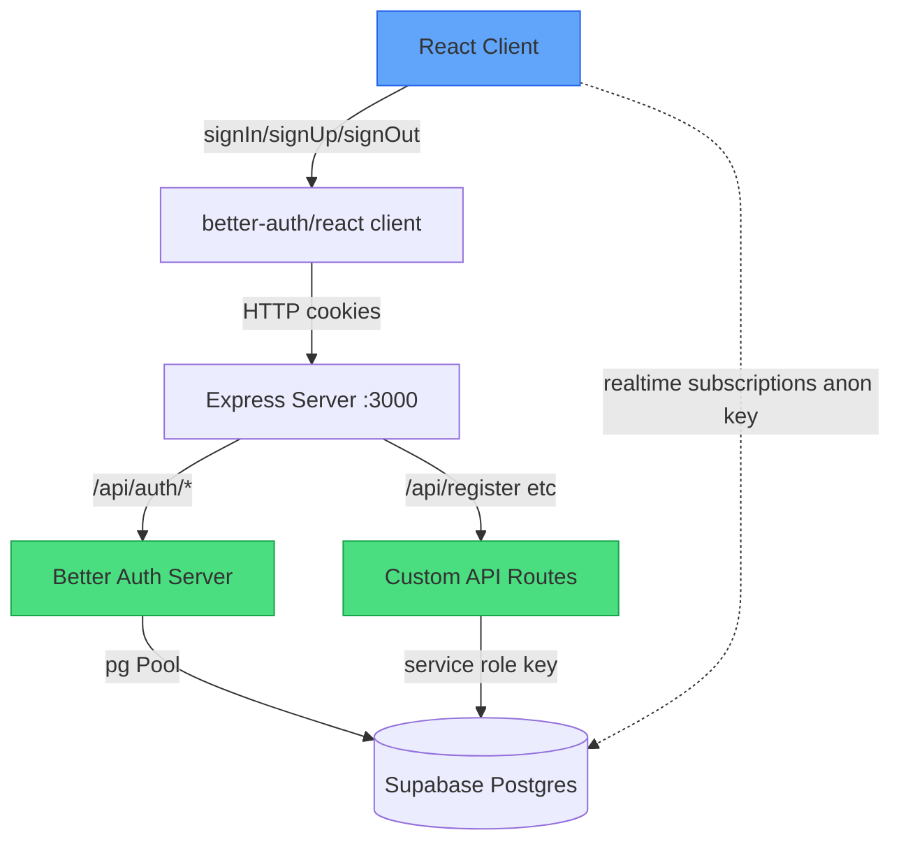

# Auth System Audit Report

## Overview

The app migrated from Supabase Auth to **Better Auth** (self-hosted, DB-backed sessions on Express). The core plumbing is solid, but several features are **half-wired** -- the client code expects them to work, but the server never finishes the job.

---

## Architecture Summary

**Three separate database access patterns coexist:**
1. **Better Auth** -- direct `pg` Pool for auth tables (user, session, account, verification)
2. **Server routes** -- Supabase admin client (service role key, bypasses RLS) for app tables
3. **Client** -- Supabase anon client for realtime subscriptions and some queries

---

## What Works

| Feature | Status | Notes |
|---------|--------|-------|
| Email + password registration | Working | Custom `/api/register` with referral validation |
| Email + password login | Working | `signIn.email()` via Better Auth |
| Google OAuth login | Working* | Needs valid `GOOGLE_CLIENT_ID` / `GOOGLE_CLIENT_SECRET` env vars |
| Session management | Working | DB-backed, cookie-based, 7-day expiry, 5-min cache |
| Auto-login after registration | Working | Calls `signIn.email()` after `/api/register` |
| Session polling | Working | Re-checks session every 60s on the client |
| Logout | Working | Calls `signOut()` (with caveats, see below) |
| Auth middleware | Working | `requireAuth` validates session server-side |
| Admin: ban user | Working | Bans in both app table and Better Auth |
| Admin: revoke sessions | Working | Uses Better Auth admin plugin |
| Referral code validation | Working | Both client-side check and server-side enforcement |
| `/api/me` profile fetch | Working | Returns app profile for authenticated user |
| Google OAuth profile creation | Working* | Creates app profile after OAuth redirect |

---

## What is BROKEN or Half-Working

### 1. Email Verification -- COMPLETELY BROKEN

**The problem:** The client checks `emailVerified` and shows a blocking verification screen, but no emails are ever sent.

- [`auth.ts:70-72`](src/server/auth.ts:70) -- `emailAndPassword` only has `enabled: true`. No `sendVerificationEmail` callback is configured.
- **No email transport exists anywhere** -- no nodemailer, no Resend, no SendGrid, nothing.
- [`App.tsx:612`](src/App.tsx:612) -- Client sets `needsEmailVerification` based on `!authUser.emailVerified`.
- [`App.tsx:9980-9983`](src/App.tsx:9980) -- "RESEND EMAIL" button just shows an alert: *"Please check your inbox"*. Does nothing.
- **Result:** Every email/password user gets permanently stuck on the verification screen. `emailVerified` will always be `false` because Better Auth never sends the verification email.

**Fix options:**
- A) Configure an email provider in Better Auth (Resend, SMTP, etc.) and add `sendVerificationEmail` callback
- B) Disable the verification check entirely if verification isn't needed yet

### 2. Password Reset -- COMPLETELY BROKEN

**The problem:** The UI calls the reset function, but no email ever arrives.

- [`auth-client.ts:36-41`](src/lib/auth-client.ts:36) -- `requestPasswordReset()` calls `authClient.forgetPassword()`
- [`auth-client.ts:47-52`](src/lib/auth-client.ts:47) -- `completePasswordReset()` calls `authClient.resetPassword()`
- **No email transport configured** on the server to deliver the reset link
- **No `/reset-password` route** in the frontend -- the app uses state-based navigation (`setView()`), not URL routing. The `redirectTo` URL would land on a blank page.
- `completePasswordReset` is exported but **never called anywhere** in the UI

**Fix:** Same as email verification -- needs an email provider configured. Also needs a frontend view to handle the reset token from the URL.

### 3. `signOut()` Not Awaited -- RACE CONDITION

- [`App.tsx:1008-1010`](src/App.tsx:1008) -- `handleLogout` calls `signOut()` without `await`, then immediately clears state
- The session cookie may not be cleared before the UI resets, leaving a stale session

**Fix:** Add `await` before `signOut()`.

### 4. Phone Number Login -- FRAGILE

- [`App.tsx:893`](src/App.tsx:893) -- Queries `users` table via Supabase anon client to find email by phone number
- This requires the `users` table to have a SELECT RLS policy allowing anon access
- If RLS is restrictive, phone-based login silently fails with *"No account found"*

### 5. Numeric ID Collision Risk

- [`routes.ts:102`](src/server/routes.ts:102) -- `Math.floor(100000 + Math.random() * 900000)` generates 6-digit IDs
- No uniqueness check before inserting
- Used as referral codes -- a collision would break referrals for the original user
- With ~900k possible values, collisions become likely after a few thousand users (birthday problem)

### 6. Google OAuth -- Env Var Silent Failure

- [`auth.ts:77-78`](src/server/auth.ts:77) -- Falls back to empty strings: `clientId: process.env.GOOGLE_CLIENT_ID || ''`
- If env vars aren't set, Google OAuth silently fails rather than throwing an error at startup
- Compare to `DATABASE_URL` and `BETTER_AUTH_SECRET` which properly `process.exit(1)` when missing

### 7. Admin Check is Hardcoded

- [`routes.ts:37`](src/server/routes.ts:37) -- Admin emails hardcoded: `['soruvislam51@gmail.com', 'shovonali885@gmail.com']`
- Better Auth has a role system (`defaultRole: 'user'`, admin plugin) but it's not used for the admin check
- Adding/removing admins requires a code change and redeploy

### 8. Registration Doesn't Auto-Set Session Cookie

- [`routes.ts:88-94`](src/server/routes.ts:88) -- `auth.api.signUpEmail()` is called server-side internally
- The session cookie from this call goes to the route handler, not the client's browser
- The client works around this by calling `signIn.email()` separately after registration (line 850)
- This means there's a brief window where the Better Auth user exists but has no session

### 9. Database.ts Uses Supabase Client Directly

- [`database.ts`](src/lib/database.ts) -- All data operations (insert, update, delete) use the Supabase anon client
- These bypass the Express server entirely, relying on Supabase RLS for security
- But auth is now handled by Better Auth, not Supabase Auth -- so `auth.uid()` in RLS policies won't work because there's no Supabase Auth session
- **This means RLS policies referencing `auth.uid()` are effectively broken** unless the policies were already updated to use service role or another approach

---

## Severity Summary

| Issue | Severity | User Impact |
|-------|----------|-------------|
| Email verification broken | **CRITICAL** | Users get permanently stuck after registration |
| Password reset broken | **HIGH** | Users who forget passwords are locked out |
| RLS + Better Auth mismatch | **HIGH** | Client-side data writes may fail silently |
| signOut not awaited | **MEDIUM** | Occasional stale sessions after logout |
| numericId collisions | **MEDIUM** | Referral codes can break at scale |
| Phone login RLS dependency | **MEDIUM** | Phone login may silently fail |
| Google OAuth silent failure | **LOW** | Only affects deployments missing env vars |
| Hardcoded admin emails | **LOW** | Requires code change to add admins |

---

## Recommended Fix Priority

1. **Fix email verification** -- either configure email transport or disable the verification gate
2. **Fix password reset** -- add email transport + frontend reset-password view
3. **Audit RLS policies** -- ensure client-side Supabase operations still work without Supabase Auth sessions
4. **Await signOut()** -- simple one-line fix
5. **Add uniqueness check for numericId** -- retry on collision
6. **Validate Google OAuth env vars at startup** -- match the pattern used for DATABASE_URL
7. **Move admin check to role-based** -- use Better Auth's role field instead of hardcoded emails
