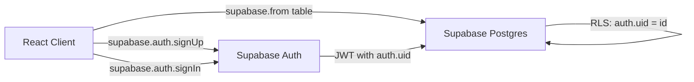
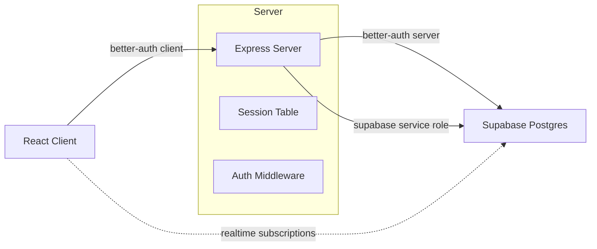

# Better Auth Migration Plan

## Context

The app currently uses Supabase Auth for authentication. Deleting a user from Supabase Auth does not invalidate active client sessions (JWT-based), requiring manual logout. Migrating to Better Auth provides:

- **Instant session revocation** -- sessions stored in DB, not just JWTs
- **Full control over registration** -- custom fields like referral codes handled natively
- **Server-side session validation** -- every request checked against DB
- **Self-hosted** -- no external auth service dependency

## Current Architecture



**Auth touchpoints in the codebase:**
- `src/lib/supabase.ts` -- Supabase client with anon key
- `src/App.tsx` -- 15 calls to `supabase.auth.*` (signUp, signIn, signOut, onAuthStateChange, getUser, signInWithOAuth, resetPasswordForEmail, resend)
- `supabase/schema.sql` -- RLS policies using `auth.uid()`, `is_admin()` function using `auth.users` table
- `server.ts` -- Express server (currently only serves Ludo game sockets + leaderboard)
- Registration flow with mandatory referral code validation via `validate_referral_code` RPC

## Target Architecture



**Key change:** The Express server in `server.ts` becomes the auth + API gateway. Better Auth manages sessions in Postgres tables. The client no longer talks directly to Supabase Auth -- it talks to the Express server for auth operations and continues using the Supabase client for realtime subscriptions only.

## Migration Steps

### Phase 1: Server-Side Setup

**1.1 Install Better Auth packages**
- `better-auth` -- server library
- `@better-auth/client` -- React client library  
- `pg` or use existing Supabase connection for the database adapter

**1.2 Create Better Auth server configuration** (`src/server/auth.ts`)
- Configure Better Auth with Supabase Postgres as the database
- Enable email/password authentication
- Enable Google OAuth social provider
- Enable email verification plugin
- Configure session settings (cookie-based, DB-backed)
- Add admin plugin for user management

**1.3 Add Better Auth tables to Supabase schema** (`supabase/schema.sql`)

Better Auth needs these tables (it can auto-create them, but we should define them explicitly):
- `ba_user` -- Better Auth user records
- `ba_session` -- Active sessions (DB-backed, instantly revocable)
- `ba_account` -- OAuth account links
- `ba_verification` -- Email verification tokens

These are separate from the existing `users` table which stores app-specific profile data.

**1.4 Mount Better Auth handler on Express server** (`server.ts`)
- Add `app.all('/api/auth/*', betterAuthHandler)` route
- Add session validation middleware for protected API routes
- Add CORS configuration for auth cookies

### Phase 2: Custom Registration with Referral Codes

**2.1 Create custom sign-up endpoint** (`server.ts` or `src/server/routes/auth.ts`)
- `POST /api/auth/register` -- accepts `{email, password, name, phone, country, age, refCode}`
- Server-side referral code validation (query `users` table for matching `numericId`)
- If invalid referral code, return 400 error before creating the user
- Create Better Auth user via `auth.api.signUpEmail()`
- Create app `users` row with profile data + `referredBy` link
- Increment referrer's `gen1Count` atomically
- Send verification email

**2.2 Handle Google OAuth with referral codes**
- Store referral code in localStorage before redirect (same as current pattern)
- After OAuth callback, server-side hook checks for pending referral code
- Better Auth `onUserCreated` hook creates the app `users` row with referral link

### Phase 3: RLS Policy Migration

This is the most impactful change. Currently RLS uses `auth.uid()` from Supabase Auth JWTs. With Better Auth, there are two approaches:

**Option A: Server-side authorization (recommended)**
- All write operations go through the Express server API
- Server validates Better Auth session, then queries Supabase using the service role key (bypasses RLS)
- Server enforces authorization rules in code
- Client still uses Supabase anon key for realtime subscriptions (read-only)
- Tighten RLS to read-only for anon key, write operations only via service role

**Option B: Custom JWT bridge**
- Server generates a Supabase-compatible JWT after Better Auth session validation
- Client uses this JWT for Supabase queries
- RLS policies continue to work with `auth.uid()`
- More complex, but preserves existing RLS patterns

**Recommendation: Option A** -- it aligns with the security audit recommendation to move all mutations server-side.

**3.1 New RLS policies:**
```sql
-- Users: read own row via anon key, writes via service role only
CREATE POLICY users_select ON users FOR SELECT USING true;
-- Remove INSERT/UPDATE/DELETE policies for anon -- only service role can write
```

**3.2 Create server API routes for all write operations:**
- `POST /api/users/profile` -- update own profile
- The financial operation RPCs from the security audit already run as SECURITY DEFINER, so they bypass RLS. They just need the caller identity passed from the server instead of `auth.uid()`.

**3.3 Update SECURITY DEFINER functions:**
- Replace `auth.uid()` checks with a `p_caller_id` parameter
- Server passes the authenticated user ID from Better Auth session
- Add server-only validation (check that caller matches the request)

### Phase 4: Client-Side Migration

**4.1 Create Better Auth client** (`src/lib/auth.ts`)
```typescript
import { createAuthClient } from 'better-auth/react';
export const authClient = createAuthClient({
  baseURL: '/api/auth'
});
```

**4.2 Replace Supabase Auth calls in App.tsx:**

| Current | Better Auth Replacement |
|---------|----------------------|
| `supabase.auth.signUp()` | `authClient.signUp.email()` via custom `/api/auth/register` |
| `supabase.auth.signInWithPassword()` | `authClient.signIn.email()` |
| `supabase.auth.signInWithOAuth({provider: 'google'})` | `authClient.signIn.social({provider: 'google'})` |
| `supabase.auth.signOut()` | `authClient.signOut()` |
| `supabase.auth.onAuthStateChange()` | `authClient.useSession()` React hook |
| `supabase.auth.getUser()` | `authClient.getSession()` |
| `supabase.auth.resetPasswordForEmail()` | `authClient.forgetPassword()` |
| `supabase.auth.resend()` | Custom endpoint or Better Auth email verification plugin |

**4.3 Update session handling:**
- Replace `onAuthStateChange` listener with Better Auth's `useSession` hook
- Session is cookie-based, so page refresh maintains auth state automatically
- Deleted users get instant session invalidation (session row deleted from DB)

**4.4 Keep Supabase client for realtime:**
- The Supabase client remains for `subscribeToTable` and `subscribeToRow`
- These use the anon key for read-only realtime subscriptions
- No auth dependency -- just public read access controlled by RLS SELECT policies

### Phase 5: Admin System

**5.1 Server-side admin check:**
- Replace client-side `ADMIN_EMAILS.includes(user.email)` with server middleware
- Better Auth admin plugin or custom role field on `ba_user` table
- All admin API routes check admin status server-side

**5.2 Admin API routes:**
- `POST /api/admin/users/:id/ban` -- ban/suspend user
- `POST /api/admin/users/:id/delete` -- delete user + revoke all sessions
- Financial admin operations already use SECURITY DEFINER RPCs

### Phase 6: Data Migration

**6.1 Migrate existing users:**
- Create a migration script that reads existing Supabase Auth users
- Creates corresponding Better Auth user + account records
- Existing `users` table profile rows remain untouched (just link via user ID)
- All active sessions will be invalidated (users must log in again)

**6.2 Remove Supabase Auth dependency:**
- Remove `supabase.auth.*` calls from client code
- Drop `auth.users` references from RLS policies
- Update `is_admin()` function to check the app `users` table instead of `auth.users`

## File Changes Summary

| File | Changes |
|------|---------|
| `package.json` | Add `better-auth`, `@better-auth/client` |
| `server.ts` | Mount Better Auth handler, add auth middleware, add API routes |
| `src/server/auth.ts` | NEW -- Better Auth server configuration |
| `src/server/routes/` | NEW -- API route handlers for protected operations |
| `src/lib/auth.ts` | NEW -- Better Auth client configuration |
| `src/lib/supabase.ts` | Keep for realtime only, possibly add service role client for server |
| `src/App.tsx` | Replace all `supabase.auth.*` calls with Better Auth client |
| `supabase/schema.sql` | Add Better Auth tables, update RLS policies, update `is_admin()` |

## Risks and Considerations

1. **All existing users will need to log in again** after migration (sessions invalidated)
2. **Google OAuth** needs reconfiguration -- redirect URIs change from Supabase to your Express server
3. **Realtime subscriptions** still work via Supabase anon key, but RLS SELECT policies may need adjustment
4. **Email sending** -- Better Auth needs an email provider configured (Resend, SendGrid, etc.) since Supabase Auth's built-in email sending is no longer available
5. **Password hashes** -- Supabase Auth uses bcrypt. Better Auth also uses bcrypt by default, but migrating existing password hashes requires careful handling
