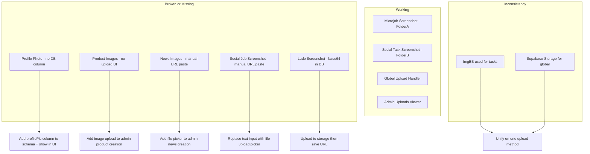

# Photo Support Analysis & PR Conflict Resolution Plan

## Part 1: Photo/Image Support Across the Project

After a deep analysis of the 10,000+ line [`App.tsx`](src/App.tsx:1) and supporting files, here is every place where photo/image support is needed, categorized by current status.

---

### A. Places That ALREADY HAVE Photo Upload Support

These areas have working image upload infrastructure:

| # | Feature | Location | Upload Method | Storage |
|---|---------|----------|--------------|---------|
| 1 | **Global Image Upload Handler** | [`uploadImage()`](src/App.tsx:755) | Supabase Storage via [`uploadFile()`](src/lib/database.ts:273) | Supabase `uploads` bucket + `uploads` table for tracking |
| 2 | **Global File Change Listener** | [`handleGlobalFileChange`](src/App.tsx:783) | Auto-detects file inputs, uploads via `uploadImage()` | Supabase Storage |
| 3 | **Microjob Screenshot** - FolderA | [`FolderAView` screenshot upload](src/App.tsx:3095) | ImgBB API via [`uploadMedia()`](src/App.tsx:3067) | ImgBB external hosting |
| 4 | **Social Task Screenshot** - FolderB | [`FolderBView` screenshot upload](src/App.tsx:3378) | ImgBB API via `uploadMedia()` | ImgBB external hosting |
| 5 | **Ludo Win Proof Screenshot** | [`LudoEarnView` file upload](src/App.tsx:6199) | FileReader `readAsDataURL` - base64 only | In-memory base64, NOT persisted to storage |
| 6 | **News Post Images** | [`TopNewsView`](src/App.tsx:2003) displays `post.imageUrl` | Admin pastes URL manually in admin panel | Just a text URL field |
| 7 | **Admin Uploads Viewer** | [Admin `uploads` tab](src/App.tsx:9597) | Views all global uploads | Reads from `uploads` table |

### B. Places That NEED Photo Support But Are MISSING or BROKEN

These are the gaps -- areas that reference images but have incomplete or no upload functionality:

| # | Feature | Problem | Line Reference |
|---|---------|---------|----------------|
| 1 | **User Profile Photo** | The global handler writes `profilePic` to the user row at [line 805](src/App.tsx:805), but the `users` table in [`schema.sql`](supabase/schema.sql:15) has NO `profilePic` column. The profile view at [line 9670](src/App.tsx:9670) shows a generic `User` icon instead of any photo. | Schema + UI gap |
| 2 | **Product Images** - E-commerce | Products are inserted with `image: ''` at [line 7341](src/App.tsx:7341) and [line 7354](src/App.tsx:7354). The `Product` interface has an `image: string` field, but admin has no way to upload product photos. | Admin panel gap |
| 3 | **News Post Image Upload** | Admin creates news at [line 6956](src/App.tsx:6956) by manually pasting an image URL into a text field at [line 8533](src/App.tsx:8533). There is no file picker or upload capability. | Admin UX gap |
| 4 | **Social Job Screenshot** | The `SocialJobView` at [line 5242](src/App.tsx:5242) asks users to paste an imgbb.com link manually into a text input. No file picker at all -- user must go to imgbb.com, upload, copy URL, and paste. | Major UX gap |
| 5 | **Ludo Screenshot Persistence** | At [line 6207](src/App.tsx:6207), the screenshot is read as base64 via `FileReader.readAsDataURL()`, but this base64 string is saved directly to the database. This is unreliable for large images and wastes DB storage. Should use Supabase Storage or ImgBB instead. | Data integrity gap |
| 6 | **Dual Upload Systems** | The project uses TWO conflicting upload methods: Supabase Storage via `uploadFile()` for the global handler AND ImgBB API via `uploadMedia()` for task submissions. This creates inconsistency. | Architecture issue |

### C. Infrastructure That EXISTS for Photo Support

```
Upload Methods Available:
1. Supabase Storage  -->  uploadFile() in database.ts (line 273)
2. ImgBB API         -->  uploadMedia() in App.tsx (line 3067)
3. Global Handler    -->  uploadImage() in App.tsx (line 755)

Database Tables for Images:
- uploads table     -->  Tracks all uploads with userId, url, context
- products.image    -->  Product image URL field
- newsPosts.imageUrl -->  News post image URL
- *.screenshot      -->  Multiple submission tables have screenshot fields

Storage Bucket:
- Supabase 'uploads' bucket configured in database.ts
```

### D. Visual Map of Photo Support Needs



---

## Part 2: PR Conflict Resolution Plan

Based on analysis of the repository `mdomarali19652007-hub/soruv_task`, here is the conflict resolution strategy for the latest PR:

### Likely Conflict Areas

Given the monolithic structure of this project -- nearly everything in one 10,000-line `App.tsx` -- PR conflicts are almost certain in these areas:

| Conflict Zone | Why It Conflicts | Resolution Strategy |
|---------------|-----------------|---------------------|
| **Import block** lines 1-69 | Any PR adding new icons or libraries touches the same dense import block | Accept both sides, deduplicate imports, maintain alphabetical order |
| **State declarations** lines 465-560 | New features add state variables in the same region | Accept both sides, ensure no duplicate variable names |
| **Type definitions** lines 104-375 | New interfaces or modified types | Merge both type definitions, check for conflicting field names |
| **View components** | Both branches may modify or add views in overlapping regions | Accept the newer logic, verify both feature sets are preserved |
| **Admin panel tabs** around line 6946 | Admin tab list is a single array -- multiple PRs adding tabs will conflict | Merge tab arrays, ensure no duplicate tab IDs |
| **View routing** lines 10008-10042 | The main render switch maps views to components | Add all new view entries from both branches |
| **Bottom nav** lines 10044-10067 | Changes to navigation structure | Pick the most complete version |
| **Supabase subscriptions** lines 730-751 | Adding new table subscriptions | Merge both subscription lists |
| **schema.sql** | New tables or columns from different PRs | Run both migrations, check for naming conflicts |

### Step-by-Step Conflict Resolution Process

1. **Fetch both branches locally**
   - `git fetch origin`
   - Identify the PR branch and target branch

2. **Create a resolution branch**
   - `git checkout -b fix/resolve-pr-conflicts`

3. **Attempt the merge**
   - `git merge origin/<pr-branch>` or rebase onto target

4. **For each conflict file, apply these rules:**
   - **Imports**: Union of both sides, remove duplicates
   - **Types/Interfaces**: Merge all fields, newer types take precedence for field type changes
   - **State variables**: Keep all from both sides
   - **UI components**: Keep both feature implementations, resolve any shared function name collisions
   - **Schema SQL**: Apply both sets of migrations sequentially

5. **Test after resolution**
   - Run `npm run lint` to catch TypeScript errors
   - Verify all views render in the router switch
   - Verify all admin tabs are present

6. **Push the resolved branch and update the PR**

---

## Part 3: Recommended Fix Priorities

| Priority | Task | Complexity |
|----------|------|-----------|
| P0 - Critical | Add `profilePic` column to `users` table in schema.sql | Low |
| P0 - Critical | Display profile photo in profile view and dashboard | Low |
| P1 - High | Add file upload picker to Social Job view replacing manual URL paste | Medium |
| P1 - High | Fix Ludo screenshot to use proper storage instead of base64 | Medium |
| P2 - Medium | Add image upload to admin product creation | Medium |
| P2 - Medium | Add file picker to admin news post creation | Low |
| P3 - Low | Unify upload systems -- pick either ImgBB or Supabase Storage | High |
| P3 - Low | Resolve PR merge conflicts | Medium |
