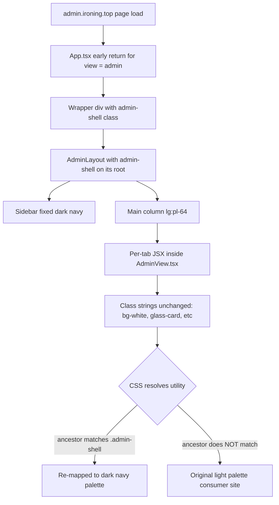

# Unify Admin Panel Theme Across All Tabs and Audit Functionality

## Goal

Make every admin sub-page on `admin.ironing.top` visually consistent with the existing dark navy theme used by the dashboard ([`AdminLayout`](src/features/admin/AdminLayout.tsx:79) + [`AdminDashboard`](src/features/admin/AdminDashboard.tsx:1)), without affecting the consumer app at `ironing.top`. Concurrently, identify and fix any tab that is a dummy/stub and not wired to real data or actions.

---

## Current State

- **Layout shell** ([`AdminLayout`](src/features/admin/AdminLayout.tsx:79)): navy palette (`bg-slate-950`, `bg-slate-900/95`, `text-slate-100`). Correct.
- **Dashboard tab** ([`AdminDashboard`](src/features/admin/AdminDashboard.tsx:1)): navy. Correct.
- **All other ~25 tabs** rendered inline inside [`AdminView.tsx`](src/features/admin/AdminView.tsx:1) (settings, features, users, news, gmail, subscriptions, facebook, microjobs, dollar-buy, dollar-sell, smm, withdrawals, deposits, ludo, tasks, drive-requests, drive-offers, products, product-orders, social, uploads): use the consumer light palette (`bg-white`, `bg-slate-50`, `border-slate-100`, `text-slate-900`, `glass-card`, indigo-on-white). Off-theme.
- The Ludo screenshot at lines 2306-2400+ confirms this: white cards, light slate borders, indigo button on white.

The stylesheet [`src/index.css`](src/index.css:1) defines `.glass`, `.glass-card`, and `.premium-card` as light-glass components; these are reused throughout the consumer app and must NOT be globally re-themed (that would break `ironing.top`).

## Constraints

- Changes must scope to the admin shell only. Consumer routes on `ironing.top` must look unchanged.
- The admin shell already has a clear DOM root (`AdminLayout`'s outer `<div>` and the early-return wrapper in [`App.tsx`](src/App.tsx:2251)). We can pin a marker class `admin-shell` (or rely on existing `bg-slate-950` ancestor) to scope CSS.
- Hint pages like Ludo, SMM, Products, Withdrawals are functionally rich (have form bindings, buttons that call `adminInsert/adminUpdate`); they are mis-themed but NOT dummies. The audit will distinguish "off-theme" from "stub".

## Strategy: scoped CSS overrides + targeted JSX cleanup

Rewriting JSX class strings across ~3000 lines of inline tabs is slow and risk-heavy. A faster, lower-risk path is **scoped CSS** that re-targets common consumer color utilities only when they're inside the admin shell. Then we layer **targeted JSX edits** for the few cases scoped CSS cannot reach (e.g. arbitrary inline gradients, or images that should be hidden in dark mode).

### Step 1 — Add an `admin-shell` marker class

Add `admin-shell` to [`AdminLayout`](src/features/admin/AdminLayout.tsx:79)'s root `<div>` and to the early-return wrapper at [`App.tsx`](src/App.tsx:2251) so every admin tree is reachable by a single selector.

### Step 2 — Add a scoped theme override layer to [`src/index.css`](src/index.css:1)

Append a new section (post `@layer components`) that re-targets the most common consumer utilities **only inside `.admin-shell`**:

```css
/* === Admin shell theme overrides ====================================
 * Re-color the consumer light utilities (bg-white, bg-slate-50,
 * border-slate-*, text-slate-900, etc.) when they appear inside the
 * admin shell so legacy JSX in AdminView.tsx renders in the dark
 * navy palette without rewriting class strings.
 *
 * Scoped to `.admin-shell` so the public app at ironing.top is
 * unaffected. Add new utility re-mappings here as gaps surface
 * during the per-tab QA pass.
 * =================================================================== */
.admin-shell {
  /* Surfaces */
  --as-surface: rgb(15 23 42 / 0.85);     /* slate-900 */
  --as-surface-2: rgb(2 6 23 / 0.6);       /* slate-950 + alpha */
  --as-border: rgb(30 41 59);              /* slate-800 */
  --as-border-strong: rgb(51 65 85);       /* slate-700 */
  --as-fg: rgb(241 245 249);               /* slate-100 */
  --as-fg-muted: rgb(148 163 184);         /* slate-400 */
  --as-accent: rgb(59 130 246);            /* blue-500 */
}

.admin-shell .bg-white,
.admin-shell .bg-white\/70,
.admin-shell .bg-white\/80,
.admin-shell .bg-white\/95 { background-color: var(--as-surface); }
.admin-shell .bg-slate-50,
.admin-shell .bg-slate-100 { background-color: var(--as-surface-2); }

.admin-shell .border-white,
.admin-shell .border-white\/30,
.admin-shell .border-white\/40,
.admin-shell .border-slate-100,
.admin-shell .border-slate-200 { border-color: var(--as-border); }

.admin-shell .text-slate-900 { color: var(--as-fg); }
.admin-shell .text-slate-700,
.admin-shell .text-slate-600,
.admin-shell .text-slate-500,
.admin-shell .text-slate-400 { color: var(--as-fg-muted); }

/* Glass surfaces */
.admin-shell .glass,
.admin-shell .glass-card,
.admin-shell .premium-card {
  background-color: var(--as-surface);
  border-color: var(--as-border);
  box-shadow: 0 8px 32px 0 rgb(0 0 0 / 0.4);
}

/* Inputs / selects / textareas */
.admin-shell input,
.admin-shell select,
.admin-shell textarea {
  background-color: var(--as-surface-2);
  border-color: var(--as-border);
  color: var(--as-fg);
}
.admin-shell input::placeholder,
.admin-shell textarea::placeholder { color: var(--as-fg-muted); }

/* Indigo / primary buttons -> blue-500 to match the sidebar accent */
.admin-shell .bg-indigo-50 { background-color: rgb(30 58 138 / 0.25); }
.admin-shell .bg-indigo-500,
.admin-shell .bg-indigo-600,
.admin-shell .from-indigo-500,
.admin-shell .from-indigo-600 { background-color: var(--as-accent); }
.admin-shell .text-indigo-500,
.admin-shell .text-indigo-600 { color: var(--as-accent); }
.admin-shell .border-indigo-100,
.admin-shell .border-indigo-500\/20 { border-color: rgb(59 130 246 / 0.35); }
```

This catches **the bulk** of the off-theme styling without touching JSX. Specificity is one class higher than the originals so it wins without `!important`.

### Step 3 — Per-tab QA pass and targeted cleanups

After CSS lands, walk each tab visually (or via grep) and patch what scoped CSS cannot:

- Inline `style={...}` color usages.
- Hard-coded gradients like `bg-gradient-to-br from-indigo-500 to-violet-600` — these will still render and look on-theme, but if any tab uses pastel gradients (e.g. amber-100→pink-100) we replace them with the navy/blue accent inline.
- Any remaining stark white backgrounds that come from inline SVGs or third-party widgets (e.g. status badges).
- Hover/active states that flash white (`hover:bg-white`) — add admin-scoped hover overrides.

### Step 4 — Functional audit (no dummy pages)

For each tab in [`AdminView.tsx`](src/features/admin/AdminView.tsx:1), confirm the following before sign-off:

| Tab | Wired to | Sign-off check |
| --- | --- | --- |
| dashboard | totals, requests, payouts | counts non-zero with seed data |
| settings | global settings table | save persists |
| features | feature flags | toggle persists |
| users | users list | filter + row actions |
| news | newsPosts | create + delete |
| gmail | gmailSubmissions | approve + reject |
| facebook | allSocialSubmissions | approve + reject |
| subscriptions | subscriptionRequests | approve + reject |
| microjobs | microjobSubmissions | approve + reject |
| dollar-buy | dollarBuyRequests | approve + reject |
| dollar-sell | withdrawals (USD) | approve + reject |
| smm | smmOrders + smmPrices | approve + price edit |
| withdrawals | withdrawals | approve + reject |
| deposits | rechargeRequests | approve + reject |
| ludo | ludoTournaments + ludoSubmissions | create + manage |
| tasks | dynamicTasks | create + manage |
| drive-requests | driveOfferRequests | approve + reject |
| drive-offers | driveOffers | create + manage |
| products | products | create + edit |
| product-orders | productOrders | approve + reject |
| social | allSocialSubmissions | approve + reject |
| uploads | allUploads | view |

For each row, open the tab in the preview deployment and confirm at least one CRUD action round-trips. Any tab that has ONLY hard-coded mock data or buttons that no-op gets either:
1. Wired to the appropriate admin API (`adminInsert/adminUpdate/adminDelete` in [`src/lib/admin-api.ts`](src/lib/admin-api.ts:1)), OR
2. Removed from the sidebar groups and the `AdminTab` union if it's not yet a real feature.

### Step 5 — Sidebar polish

Verify [`AdminLayout`](src/features/admin/AdminLayout.tsx:55) `groups` ordering matches the sub-page list and that there are no orphan IDs (an item in groups that doesn't render any content — those would look broken). The Ludo screenshot shows extra items below the visible viewport (`SHOP & ORDERS`, `DRIVE & BOOSTING`, `CONTENT LIBRARY`, `MANAGEMENT`) — confirm they all match real `activeAdminTab` cases.

---

## Implementation Checklist (in execution order)

- [ ] Add `admin-shell` class to [`AdminLayout`](src/features/admin/AdminLayout.tsx:79) root and to the admin early-return wrapper in [`App.tsx`](src/App.tsx:2251).
- [ ] Add the **Admin shell theme overrides** CSS block to [`src/index.css`](src/index.css:1) (post-`@layer components`).
- [ ] Run preview deployment, walk each tab, screenshot or note any remaining off-theme spot.
- [ ] For each gap, either extend the scoped CSS block or patch the offending JSX class string in [`AdminView.tsx`](src/features/admin/AdminView.tsx:1).
- [ ] Functional audit per the table above. For each tab confirm at least one CRUD round-trip and (in code) that the rendered list is bound to the corresponding prop, not a literal array.
- [ ] Drop or wire any tab that's a stub.
- [ ] Verify sidebar `groups` -> `activeAdminTab` coverage is 1:1 (no orphan IDs).
- [ ] Confirm consumer site at `ironing.top` is visually unchanged (spot-check Home, Dashboard, Workstation, Wallet, Settings).
- [ ] `npm run typecheck`, `npm run test`, `npm run lint`, `npm run build` all green.
- [ ] PR to master with screenshots before/after for at least 4 representative tabs.

---

## Risk and Mitigation

| Risk | Mitigation |
| --- | --- |
| Scoped CSS bleeds onto consumer site | All overrides nested under `.admin-shell` selector; consumer DOM never carries that class. |
| Some utility (e.g. `bg-white/70`) doesn't match because Tailwind's escape sequence differs | Add the missed selector to the override block as gaps are found during QA. |
| Inline `style={{ background: '#fff' }}` slips through | Targeted JSX patch during Step 3. |
| Functional audit reveals genuine missing backend endpoints | Out of scope for this PR; either hide the tab or open a follow-up issue. |

---

## Rendering Architecture After Fix



---

## Out of Scope

- Decomposing the 3107-line [`AdminView.tsx`](src/features/admin/AdminView.tsx:1) into per-tab files. Worth doing later but not required for the visual unification.
- Dark/light toggle. The admin shell is dark-only by design.
- Re-skinning [`AdminDashboard`](src/features/admin/AdminDashboard.tsx:1) — already on-theme.
